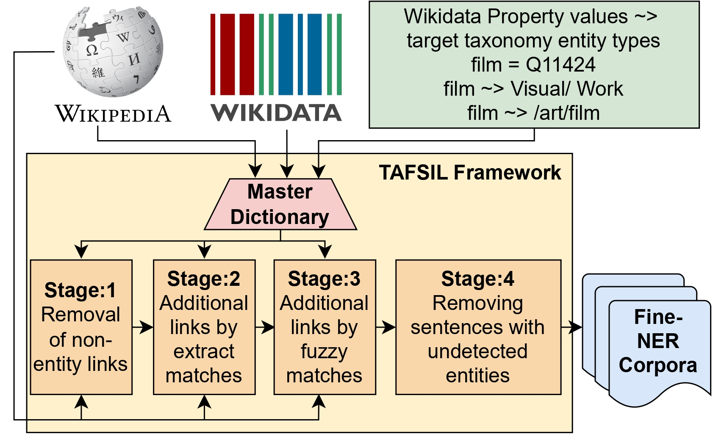

# [TAFSIL: Taxonomy Adaptable Fine-grained Entity Recognition through Distant Supervision for Indian Languages](https://huggingface.co/datasets/prachuryyaIITG/TAFSIL/resolve/main/TAFSIL_SIGIR_poster.pdf)

**TAFSIL** is a taxonomy-adaptable Fine-grained Entity Recognition (FgER) framework designed to create FgER datasets in six Indian languages: Hindi (hi), Marathi (mr), Sanskrit (sa), Tamil (ta), Telugu (te), and Urdu (ur). These languages belong to two major language families—Indo-European and Dravidian—and are spoken by over a billion people worldwide.

TAFSIL leverages the high interlink between the knowledge base WikiData and linked corpora Wikipedia through multi-stage heuristics. It enhances annotation quality using fuzzy matching and quality sentence selection techniques. The framework enables the creation of datasets totaling approximately three million samples across the six languages mentioned.

Utilizing the TAFSIL framework, various datasets have been created under four taxonomies: **FIGER**, **OntoNotes**, **HAnDS**, and **MultiCoNER2**.

[**Read the paper**](https://dl.acm.org/doi/10.1145/3726302.3730341)

[**Read the poster**](https://huggingface.co/datasets/prachuryyaIITG/TAFSIL/resolve/main/TAFSIL_SIGIR_poster.pdf)

## TAFSIL Framework Overview



*Figure: Overview of the TAFSIL framework.*

## Dataset Statistics

### TAFSIL Datasets Statistics

| Taxonomy     | Language | Sentences | Entities | Tokens     |
|--------------|----------|-----------|----------|------------|
| **FIGER**    | Hindi    | 697,585   | 928,941  | 25,015,025 |
|              | Marathi  | 138,114   | 193,953  | 4,010,213  |
|              | Sanskrit | 18,946    | 25,515   | 520,970    |
|              | Tamil    | 523,264   | 825,287  | 17,376,040 |
|              | Telugu   | 419,933   | 616,143  | 10,103,255 |
|              | Urdu     | 641,235   | 1,219,517| 43,556,208 |
| **OntoNotes**| Hindi    | 699,557   | 1,177,512| 32,234,646 |
|              | Marathi  | 138,535   | 194,317  | 4,021,660  |
|              | Sanskrit | 19,201    | 25,459   | 520,836    |
|              | Tamil    | 522,768   | 796,498  | 16,817,316 |
|              | Telugu   | 420,700   | 608,041  | 9,982,017  |
|              | Urdu     | 646,713   | 1,197,187| 42,869,948 |
| **HAnDS**    | Hindi    | 702,941   | 1,108,130| 30,249,166 |
|              | Marathi  | 139,163   | 195,251  | 4,039,536  |
|              | Sanskrit | 19,294    | 25,581   | 523,540    |
|              | Tamil    | 526,275   | 804,132  | 16,988,161 |
|              | Telugu   | 422,736   | 611,226  | 10,034,077 |
|              | Urdu     | 647,595   | 1,200,111| 42,988,031 |
| **MultiCoNER2**| Hindi | 643,880   | 799,987  | 21,492,069 |
|              | Marathi  | 125,981   | 174,861  | 3,628,450  |
|              | Sanskrit | 17,740    | 23,372   | 479,185    |
|              | Tamil    | 464,293   | 690,035  | 14,583,842 |
|              | Telugu   | 392,444   | 561,088  | 9,266,603  |
|              | Urdu     | 603,682   | 1,069,354| 38,216,564 |

### TAFSIL Gold Dataset Statistics in FIGER Taxonomy

| Language | Dev Entities | Dev Tokens | Test Entities | Test Tokens | IAA (κ) |
|----------|--------------|------------|---------------|-------------|---------|
| Hindi    | 2,910        | 20,362     | 1,578         | 11,967      | 83.34   |
| Marathi  | 2,905        | 16,863     | 1,567         | 10,527      | 80.67   |
| Sanskrit | 2,891        | 14,571     | 1,570         | 8,354       | 78.34   |
| Tamil    | 2,885        | 15,334     | 1,562         | 8,961       | 76.53   |
| Telugu   | 2,895        | 15,359     | 1,568         | 9,090       | 82.04   |
| Urdu     | 2,710        | 21,148     | 1,511         | 12,505      | -       |

### TAFSIL Gold Datasets Inter-Annotator Agreement (κ) Across Taxonomies

| Taxonomy     | Hindi | Marathi | Sanskrit | Tamil | Telugu |
|--------------|-------|---------|----------|-------|--------|
| **FIGER**    | 83.34 | 80.67   | 78.34    | 76.53 | 82.04  |
| **OntoNotes**| 81.41 | 78.88   | 76.98    | 75.23 | 80.24  |
| **HAnDS**    | 83.65 | 80.03   | 77.12    | 75.63 | 81.21  |
| **MultiCoNER2**| 84.66 | 81.84 | 79.82    | 77.89 | 83.86  |

*Note: IAA (Inter-Annotator Agreement) scores are represented using Cohen's κ.*

## 🚀 How to Use

### Loading the Dataset

```python
from datasets import load_dataset
dataset = load_dataset("prachuryyaIITG/TAFSIL")

```

## 🚀 More resources
* [TAFSIL Dataset](https://huggingface.co/datasets/prachuryyaIITG/TAFSIL)
* [Interactive Demo](https://huggingface.co/spaces/prachuryyaIITG/AWED-FiNER)
* [Agentic tool: AWED-FiNER](https://github.com/PrachuryyaKaushik/AWED-FiNER)

## Citation

If you use this dataset, please cite the following paper:

```bibtex
@inproceedings{kaushik2025tafsil,
  title={TAFSIL: Taxonomy Adaptable Fine-grained Entity Recognition through Distant Supervision for Indian Languages},
  author={Kaushik, Prachuryya and Mishra, Shivansh and Anand, Ashish},
  booktitle={Proceedings of the 48th International ACM SIGIR Conference on Research and Development in Information Retrieval},
  pages={3753--3763},
  url = {https://doi.org/10.1145/3726302.3730341},
  doi = {10.1145/3726302.3730341},
  year={2025}
}

